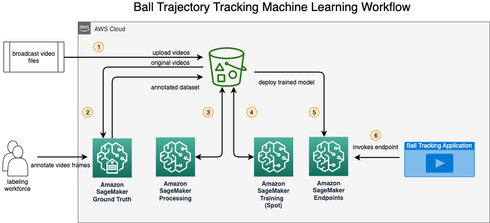

# High-speed Ball Tracking Application in Sports Broadcast Videos

## Introduction
In ball Sports, ball tracking data is considered one of the fundamental and useful information in evaluating players’ performance and game strategies. Until recently, it was a challenge to come up with a reliable technique that would accurately recognize and position balls in sports that involve tiny balls moving at high-speed. For instance, tennis, badminton, baseball or golf. 

In this project, we are going to build an end to end machine learning workflow that prepares video files, performs model training and standing up a realtime endpoint in SageMaker. A sample application is also included that takes a sports broadcast video and produce a separate video file that contains ball trajectory thats overlays the original video. 

The following diagram dipicts a high level solution architecture that supports the development work.


## Architecture Diagram




## Solution Overview
Specifically, the end to end machine learning workflow encapsulates the following main steps:

1. Upload the relevant sport broadcast video files to S3 bucket. These video files are to be annotated with labels. 
2. Label video frames by using Amazon Sagemaker Ground Truth labeling job.
3. Process the ground truth labels to create features for model training using a SageMaker Processing job.
4. Train a deep learning model (Tracknet) using a Sagemaker training job with GPU instance.
5. Deploy a realtime HTTPS endpoint for serving the model for predicting ball positions. 
6. Produce a ball tracking video for a given broadcast video file through invoking the deployed HTTPS endpoint.

## Quick Start Guide
### Prerequisites

The code and the notebooks used in this repository were tested using [Amazon SageMaker](https://aws.amazon.com/sagemaker/). For best experience, we highly recommend using [SageMaker Studio](https://aws.amazon.com/sagemaker/studio/) or [SageMaker Notebook instances](https://docs.aws.amazon.com/sagemaker/latest/dg/nbi.html). 

If this is your first time using Amazon SageMaker, here's a good [starting point](https://docs.aws.amazon.com/sagemaker/latest/dg/gs-set-up.html) on setting up the SageMaker environment.

This project integrates with other AWS services, including S3, SageMaker Ground Truth and Amazon Cognito to provide an end to end solution. When configuring access control through IAM policies, we recommend getting started with the AWS managed policies, and move towards the least privilege permissions as a best practice.

Here're a list of Managed IAM Policies to associate with the SageMaker Execution Role: 
* [SageMakerFullAccess](https://docs.aws.amazon.com/sagemaker/latest/dg/security-iam-awsmanpol.html#security-iam-awsmanpol-AmazonSageMakerFullAccess)
* [SageMakerGroundTruth](https://docs.aws.amazon.com/sagemaker/latest/dg/security-iam-awsmanpol-ground-truth.html)

Please refer to the following [IAM policy examples](https://docs.aws.amazon.com/sagemaker/latest/dg/security_iam_id-based-policy-examples.html) for additional customizations that provide finer grained permissions that meet your security requirements.

### Starting Point
To get started, you need to clone the project into your SageMaker Studio environment:

```
> git clone https://github.com/wei-m-teh/sagemaker-tracknet-v2
> cd sagemaker-tracknet-v2
```


## Ground Truth Labeling Job

Assuming the original broadcast video files are uploaded to S3 bucket, we are going to apply appropriate labels to the video frames. SageMaker [Ground Truth](https://aws.amazon.com/sagemaker/data-labeling) is a data labeling service that makes it easy to label data in various formats and gives you the option to use human annotators through Amazon Mechanical Turk, third-party vendors, or your own private workforce. In our example, we are going to create a ground truth labeling job with private workforce to annotate the uploaded videos.

The sample videos files we tested for this project can be found [here](https://drive.google.com/drive/folders/1L5tB49TJdMVQfrLJ2BBwxx9zYw8n8wMb?usp=sharing)

Instructions on how to create a SageMaker Ground Truth labeling job can be found [here](Part1_Labeling.ipynb).

## Feature Engineering 

Once the video files are labeled, we will create the features to train a model. Given large volume of labeled data (labels are applied to every video frame in video files), we will leverage a SageMaker Processing job to help us featurize the dataset required for training a model. Instructions on how to create a SageMaker Processing Job can be found [here](Part2_Processing.ipynb).


## Model Training

Once feature engineering step is complete, all the input data required for training a model should be available in the speicfied S3 bucket location. We will trigger a SageMaker Training job to train a model, as followed [here](Part3_Training.ipynb).


## Deploy Model Endpoint and Generate Ball Tracking Trajectory Video Files
After the model is trained successfully, we can now deploy a SageMaker endpoint to serve inference for the video files. 
With a realtime endpoint deployed in SageMaker, you can then create ball tracking videos by integrating the deployed endpoint with your own videos. A sample application is included in this repository to demonstrate the capability in action [here](Part4_Inference.ipynb). To run the application, use any badminton videos that you would like to track the ball movements, or you could use one of the videos referenced [here](https://drive.google.com/drive/folders/1L5tB49TJdMVQfrLJ2BBwxx9zYw8n8wMb?usp=sharing).


## Running this repository in SageMaker Local Mode
If you would like to run this notebook in local mode, please follow the intructions [here](local-mode/README.md).

**NOTE:**

If you would like to run these notebooks in Sagemaker Notebook instance environment, you will need to make sure the current backend for keras.json is pointed to tensorflow. You can do so by running the following command in your terminal. 
```bash
cp -f ~/.keras/keras_tensorflow.json ~/.keras/keras.json
```

## Prediction Results
Inference application will save the results and prediction labels (visibility) and the location of the ball in a csv file. The sample file below represents an example of the prediction results above. Take a look at the ball closely and observe the red dot following the movement of the ball.


## License
This library is licensed under the MIT-0 License. See the LICENSE file.
